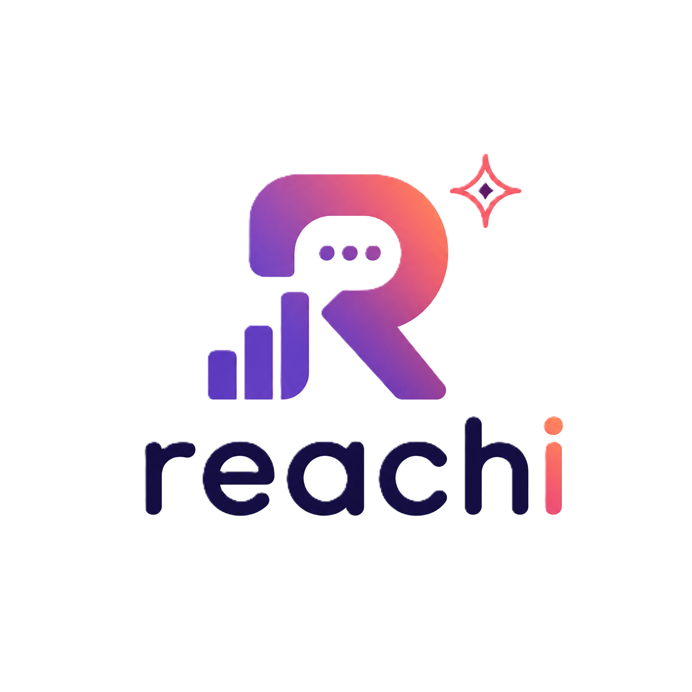

# 🚀 VibeCheck | ENIT HACK 2026

<p align="center">
  
</p>

> **The next-generation Tunisian Influencer Analysis & Matching Platform.** Powered by Multi-Agent AI (CrewAI) and Real-time Voice Interaction.

---

## 🌟 Core Features

### 🎙️ Real-time Voice Assistant ("Sarra")
*   **Digital Friend AI**: A dynamic, witty Tunisian AI assistant that speaks English and Derja.
*   **Azure Realtime Audio**: Low-latency voice interaction via WebSocket.
*   **Actionable Intelligence**: Just ask Sarra to "investigate" an influencer, and she'll trigger an OSINT search.

### 🕵️ OSINT Investigation Crew
*   **Multi-Agent Pipeline**: Powered by **CrewAI** to research biography, followers, controversies, and brand collaborations.
*   **Live Hacker Terminal**: Stream real-time backend agent logs directly to the frontend via SSE (Server-Sent Events).
*   **Azure GPT-5.4 Nano**: Leveraging cutting-edge inference for deep analysis.

### 🎯 Product-Influencer Matchmaker
*   **Vision-Powered**: Upload a product image (Groq Llama-4 Vision) or describe it to find the perfect fit.
*   **Strategic Scoring**: Sophisticated algorithm accounts for Niche Affinity, Audience Health (NPS), Engagement, and Gender Relevance.
*   **Discovery Engine**: Discovers non-audited influencers in real-time for niches like Beauty, Men's Fashion (Exist), and more.

### 📊 Deep Sentiment Analytics
*   **Instagram/TikTok Scraping**: Integration with Apify to pull real-time comments.
*   **CQS (Community Quality Score)**: A weighted metric measuring Sentiment, Authenticity, and Toxicity.
*   **VS Comparison**: Side-by-side influencer battle mode to compare engagement stats and audience quality.

---

## 🛠️ Tech Stack

### Frontend
- **Framework**: React 18 + Vite
- **Styling**: Tailwind CSS + Glassmorphism UI
- **Animations**: Framer Motion
- **Icons**: Lucide React
- **Audio**: Web Audio API (PCM16)

### Backend
- **Core**: FastAPI (Python 3.11+)
- **AI Orchestration**: CrewAI + LangChain
- **LLM Providers**: 
  - **Azure OpenAI**: Realtime Voice, Chat (gpt-5.4-nano)
  - **Groq**: Llama-4-Scout (Vision Analysis)
- **Data & Scraping**: Apify API
- **Streaming**: SSE (Server-Sent Events) for log broadcasting

---

## 🚀 Getting Started

### 1. Prerequisites
- Python 3.11+
- Node.js 18+
- Azure OpenAI Service (Realtime & AI Inference)
- Apify & Groq API Keys

### 2. Backend Setup
```bash
# Install dependencies
pip install -r requirements.txt

# Create .env file
cp .env.example .env
# Fill in your AZURE_API_KEY, AZURE_API_BASE, APIFY_API_KEY, GROQ_API_KEY

# Run the API
python -m uvicorn api:app --reload
```

### 3. Frontend Setup
```bash
cd frontend
npm install
npm run dev
```

### 4. Environment Configuration
Your `.env` should include:
- `AZURE_API_BASE`: Endpoint for the OSINT Crew (roua10)
- `AZURE_OPENAI_ENDPOINT`: Endpoint for Realtime Speech (sarra)
- `APIFY_API_KEY`: For social media scraping
- `GROQ_API_KEY`: For vision analysis

---

## 🏗️ Project Structure

```text
├── api.py                 # Main FastAPI Entry Point
├── sm_crew/               # CrewAI Multi-Agent Definition
│   └── src/sm_crew/voice_crew.py
├── frontend/              # React Application
│   ├── src/pages/         # ProductMatch, SmartSearch, AnalyzePost
│   ├── src/components/    # VoiceWidget, VSCompare, Pill
│   └── src/hooks/         # useRealtimeAudio (WebSocket logic)
├── data/                  # Persisted reports and influencer JSON
└── .env                   # Configuration
```

---

## 🎨 Design Philosophy
The platform features a **Premium Dark Aesthetic** with "Glassmorphism" elements, vibrant gradients (Indigo to Teal), and interactive micro-animations to provide a high-end experience for brand managers and market researchers.

---

## 🏆 Hackathon Details
Developed for the **ENIT HACK 2026**.
Team: **Vortex**

---

*Made with ❤️ for the Tunisian Tech Ecosystem.*
